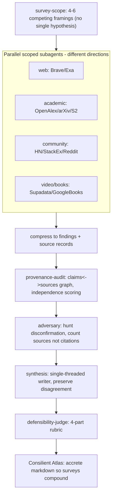

# Aletheia

*alḗtheia* — "unconcealment, disclosure." A research **surveyor**: it gives you an accurate, bird's-eye picture of a field or task, and it is built to resist the three failure modes that wreck ordinary research agents:

1. **Anchoring / consensus-lock** — forming one hypothesis (usually the consensus one) and conditioning every downstream query, source-selection, and synthesis on it.
2. **A narrow source diet** — living on one web index whose SEO/editorial bias dominates ranking.
3. **Bias sources** — treating "40 blogs echoing 1 paper" as 40 independent confirmations.

Aletheia is delivered as a **portable skill suite with optional MCP/connectors** — no standalone app. It runs in Cursor, Claude Code, Codex, and any harness that reads `SKILL.md` plus the relevant configuration.

> What makes this better than a bare LLM: it **refuses to anchor** (holds 4-6 competing framings and commits to none), pulls **current, diverse, real sources** the model can't reach, **reads them in full**, **judges whether support is independent or just one origin echoed** (by reading what's cited — a judgment, not a graph), **attacks its own leading conclusion** before believing it, and answers with **every claim tied to a source**, disagreement kept visible.

## The one architectural rule

The pro-swarm (Anthropic, +90.2% on breadth-first) vs. anti-swarm (Cognition, "Don't Build Multi-Agents") debate is not a contradiction — it's a **decomposition rule**, and the Berkeley MAST failure taxonomy (37% inter-agent misalignment, 21% verification failures) says where the danger is:

- **Parallelize the independent parts** — heterogeneous channels x competing framings (fan-out subagents, each a *different, tightly-scoped direction*).
- **Single-thread the interdependent parts** — hypothesis arbitration, provenance reconciliation, synthesis (one writer, continuous context).
- **The adversary is read-only and procedural** — an "intelligence contributor," not a parallel writer.



## Skills

> **Current OpenAI/Codex skill: `aletheia-research` 0.5.0-openai.1.** The flagship is the deep, multi-perspective tree
> surveyor — built off **deep-aletheia 0.2** (which won a blind LLM-judge on completeness, source
> variety, and grounding), keeping its good parts and adding a decisive-source hunt, chase-the-primary
> discipline, wider source variety, and a thoroughness dial. See `docs/aletheia-0.3-design.md` and the
> bake-off in `docs/evals/`. Invoke: *"use the aletheia-research skill to survey \<topic\> (thoroughness: auto)."*

| Skill | Role |
|-------|------|
| **`aletheia-research` 0.5.0-openai.1** | **Current OpenAI/Codex line.** Topic-relative capped source triage, final-brief claim-scope verification, and reproducible runtime traces; defaults to unbounded convergence. |
| `deep-aletheia` 0.2 | *Frozen — direct ancestor of aletheia-research 0.3; eval baseline.* |
| `surveyor` 0.1 | *Retired 2026-07-08 — eval baseline (single-agent).* |
| `aletheia` v1.0 | *Retired — original single-agent loop; superseded by `aletheia-research`.* |
| `survey-scope` | Turns a topic into a **portfolio of competing framings** + scoped subagent specs. Resolves entities *before* searching. |
| `channel-retrieval` | Per-channel playbooks. Every result is tagged with `index_of_origin` + an **evidence / lead-gen / color** class. |
| `iterative-deepening` | Breadth x depth search loop with reflection (search -> learn -> recurse into gaps). Turns flat fan-out into real research. |
| `provenance-audit` | Judge (by reading) whether support is independent or one origin echoed — not a graph. |
| `adversary` | Attack your own leading conclusion: hunt disconfirmation before believing it. |
| `synthesis` | Single-threaded writer; preserves disagreement instead of laundering it. |
| `defensibility-judge` | 4-part rubric: is a belief actually defensible? |
| `depth-channels` | YouTube + podcast transcripts (paid/toggle) as corroborate-before-citing color. |
| `consilient-atlas` | Accretes each survey into a growing knowledge base so surveys compound. |

Suite utilities live in `channel-retrieval/scripts/` (global after install): `doctor.py` (channel health-probe + ordered failover), `channels.py` (enable/disable the core), the no-install channel clients, `rerank.py`, and `read.py`.

## Core connectors (enabled) vs. the rest (hidden)

The **safe core runs with ZERO API keys** and contains only direct, no-session clients. Optional channels are disabled until the user enables them; this includes YouTube (third-party media tooling) and X (browser/session or paid API). Aletheia adds the epistemic layer on top. Authenticated browser/session access is always explicit: normal page and Reddit reads do not silently fall back to a logged-in browser.

| Role | Channel(s) | Key |
|------|-----------|-----|
| Web search x2 (independent) | **Marginalia** (independent) + **DuckDuckGo** | none — add free **Brave** key or paid **Exa** to upgrade |
| Latest video (opt-in) | **YouTube** — `youtube.py --latest` (yt-dlp `ytsearchdate` discovery) + `youtube-transcript-api` | none (review/install optional media deps) |
| Social pulse (opt-in, color) | **X** via **agent-reach** (browser session) | explicit capability grant (paid GetXAPI/twitterapi optional) |
| Primary / independence backbone | **OpenAlex** + **arXiv** + **Europe PMC** | none — add free OpenAlex key for volume |
| History / books | **Wikipedia** + **Open Library** | none — enable Google Books when its keyless quota is healthy |
| Un-laundered layer | **Reddit** (PullPush) + **Hacker News** | none |
| Depth | **read.py** (Jina: pages + PDFs) | none |

Manage the core (after a portable Codex install):
```bash
AL="${CODEX_HOME:-$HOME/.codex}/skills/.aletheia-runtime/skills"
python3 "$AL/channel-retrieval/scripts/channels.py" list        # the enabled core
python3 "$AL/channel-retrieval/scripts/channels.py" list --all  # every channel, [on]/[off]
python3 "$AL/channel-retrieval/scripts/channels.py" enable stackexchange       # for software
python3 "$AL/channel-retrieval/scripts/channels.py" enable google_books gutenberg  # for history
python3 "$AL/channel-retrieval/scripts/channels.py" reset       # back to the core
```
The agent uses only enabled channels (`channel-retrieval` enforces this). Hidden channels stay ready — pick per topic rather than firing all of them (more channels != more rigor).

## Install

**Cursor** (this repo): skills live in `.cursor/skills/` and load automatically. MCP servers load from `.cursor/mcp.json`.

**Use it in Codex from any directory (portable default).** Validate, then install a self-contained runtime:
```bash
python3 scripts/preflight.py
bash scripts/install.sh          # copied Codex runtime; does not touch Cursor or Claude
# bash scripts/install.sh --link # developer mode; depends on this checkout remaining in place
# bash scripts/install.sh --all  # explicit portable runtime closure for Cursor, Claude Code, and Codex
```
Then invoke *"use the aletheia-research skill to survey \<topic\>."* In Codex, `$aletheia-research` is available after starting a new session. The copied runtime keeps its required sibling skills under `${CODEX_HOME:-$HOME/.codex}/skills/.aletheia-runtime/`, so it does not depend on the checkout after installation. Normal copy mode derives the closure from committed `HEAD` rather than untracked or uncommitted local material; `--allow-dirty` is only for developer forward-testing. Use `--dry-run` before an update; the installer refuses to replace an unrelated skill without `--force` and keeps a timestamped backup.

**Keys and capabilities**: keep keys outside the checkout: create `${ALETHEIA_CONFIG_DIR:-${XDG_CONFIG_HOME:-$HOME/.config}/aletheia}/.env` from `.env.example`, keep it owner-only (`chmod 600`), and fill in only what you need. The free core needs almost nothing (the bundled REST clients cover it). Optional channels stay disabled until enabled in the user-scoped channel overlay; browser/session use also needs both an explicit `--browser` request and a matching host capability grant. The repository contains an optional MCP catalog, but the portable runtime intentionally ships no enabled third-party MCP servers; configure any such connector separately. Run `python3 "$AL/channel-retrieval/scripts/doctor.py"` to check enabled channels. See [`docs/PORTABILITY.md`](docs/PORTABILITY.md) for the fresh-machine path, container reference, and honest security boundary.

## Run a survey

Invoke the orchestrator skill (by name) with a topic, e.g. *"survey the state of X."* It will:
1. propose a portfolio of framings and confirm scope with you,
2. fan out scoped retrieval across independent channels,
3. audit provenance/independence, run the adversary,
4. synthesize (disagreement preserved), score defensibility, and offer to append to the Atlas.

## The discipline is core; these scripts are just conveniences

The **hypothesis portfolio** (anti-anchoring), **judging source independence by reading**, and the **adversary** pass are core steps — they live as agent discipline in the `aletheia` loop, not as machinery. The scripts below are optional add-ons:
- `provenance-audit/scripts/provenance_graph.py` — *computes* independence when a source set is too big to judge by hand (normally you judge it while reading — see the `provenance-audit` skill).
- `defensibility-judge/scripts/rubric.py` — a 4-point check before committing to a spiky claim.

All scripts are pure Python 3.9+ stdlib — no install required, covered by `tests/`.

## Naming

This is a Skill/MCP **bundle**, not an npm/PyPI package. If you ever publish connectors, avoid the name `aletheia-mcp` — an unrelated OpenAlex citation-graph MCP already uses it.

## Ethics & legality

The books channel is restricted to legally-defensible sources (Google Books snippets, Open Library / Internet Archive metadata + public-domain full text, Project Gutenberg, Standard Ebooks). Aletheia does **not** wire shadow libraries (Anna's Archive / LibGen / Z-Library) and does **not** automate Internet Archive borrowing. See `.cursor/skills/channel-retrieval/reference.md`.

## Status

Built in milestones (see `.cursor/plans/` for the source plan). Each skill is independently usable.
Production, experimental lines, immutable tags, and navigation commands are cataloged in
[`docs/BRANCHES.md`](docs/BRANCHES.md). The evidence-backed self-audit and current improvement
sequence are preserved in
[`docs/research/2026-07-27-agent-output-quality/`](docs/research/2026-07-27-agent-output-quality/README.md).
