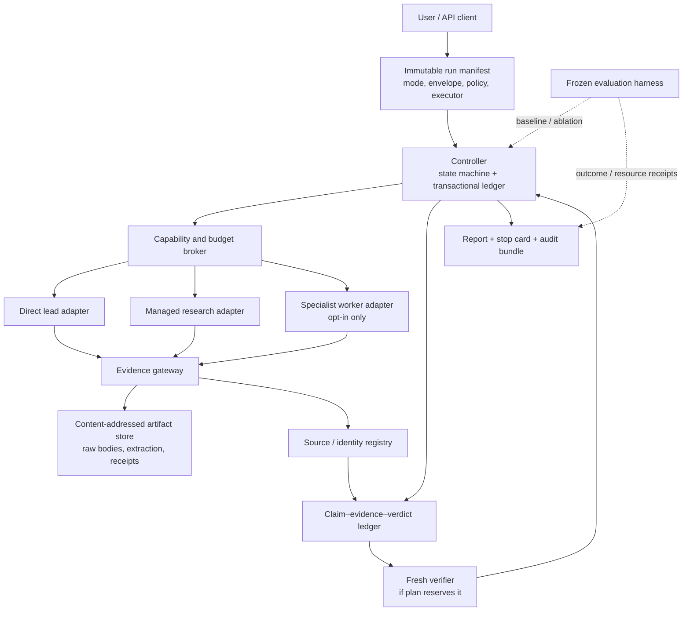

# Aletheia v2 — ground-up design decision

**Status:** architecture recommendation, not an implementation or a performance claim
**Date:** 2026-07-29
**Decision:** build a small, bounded research-control kernel first; make a single accountable lead the default; admit managed and multi-agent execution only behind an explicit, auditable contract.

## The answer

V2 should **not** be a larger version of the current research tree. It should be a
research-control system whose narrow guarantees are mechanically true:

- a run has a finite, visible resource and capability envelope;
- an external body cannot become evidence merely because it is long or has the
  requested URL in its filename;
- retries, crashes, and concurrent workers cannot silently create duplicate work,
  stale plan state, or a completed-looking run;
- each consequential final claim has a stable identifier, a disposition, and an
  evidence path (or an explicit gap); and
- every additional mechanism has to beat a competent direct baseline under an
  immutable, cost-matched evaluation contract.

The default product is therefore **Bounded Research**: one lead agent, a finite
plan, controller-mediated tools, identity-qualified evidence, atomic claims, and
one metered verification pass when the requested assurance level warrants it.
Parallel investigators are an **Audited Investigation** service level, not a
synonym for "thoroughness" and never an unbounded default.

This direction is not a claim that v2 will outperform OpenAI Deep Research,
Gemini Deep Research, Anthropic Research, LangChain Open Deep Research, GPT
Researcher, or a skilled direct agent. The local controlled comparison currently
ties the direct and elaborate conditions at 11/20 factual-rubric coverage after
correction, while the elaborate condition assigned 28 document reads versus 8.
That is strong evidence against assuming that ceremony is a free quality gain,
not evidence that decomposition can never help. See the [corrected
comparison](../2026-07-28-deep-runtime-and-head-to-head/comparison/results.md)
and [independent method audit](../2026-07-28-deep-runtime-and-head-to-head/comparison/independent-method-audit.md).

## Why a rewrite is justified, but a platform is not

The prior audit found a real control-plane failure, not merely a few rough
heuristics. The current runtime is a skill protocol plus a mutable filesystem
blackboard. A worker can write files that represent successful state; the
runtime cannot establish that the worker actually honored the protocol. In
particular, the audit reproduced:

1. a long, unrelated body becoming a successful evidence read;
2. stale/duplicate/replayed tree state and concurrent-cap violations;
3. an `unlimited` setting without a cap on the resources users actually care
   about (model use, money, elapsed time, external requests, reads, or human
   effort); and
4. an unproved quality premium from the complicated workflow.

Those are enough to reject the current authority model. They are **not** enough
to justify starting with a distributed workflow engine, generic plugin platform,
autonomous prompt evolution, or multi-agent swarm. The appropriate response is
to change the authoritative substrate while keeping the first execution path
small.

The design is deliberately split into two questions:

| Question | V2 answer |
|---|---|
| How should a source-bound, budgeted research run be controlled? | A controller-owned transaction/event ledger, content-addressed source artifacts, typed claims, and a tool/capability broker. |
| How should a model find and explain an answer? | Pluggable executor policy: a direct lead by default, optionally a managed provider or bounded specialists. |

That separation lets the project improve the part unique to Aletheia—evidence,
governance, and evaluation—without trying to recreate every browser, model,
queue, or hosted research system.

## Product boundary and service levels

Aletheia needs distinct service levels with different promises. "More effort" is
not enough information when the mechanism, cost, and assurance meaning change.

| Mode | Executor shape | What is promised | What is deliberately not promised |
|---|---|---|---|
| **Answer / lookup** | One model/tool interaction | Small bounded response; no research-assurance badge. | Broad coverage, a durable evidence case file, or independent verification. |
| **Bounded Research (default)** | One accountable lead plus optional fresh verifier. | A fixed envelope, source receipts, identity-qualified evidence, claim ledger, stop card, and a partial/abstain result when necessary. | Exhaustive web coverage or a claim of superior intelligence. |
| **Managed Research (wrapped)** | A managed research API is the executor; v2 records and normalizes what it exposes. | Provider/job/version/usage provenance; v2 evidence checks where source bodies are available. | That provider citations are automatically identity-bound or semantically verified. |
| **Audited Investigation (opt in)** | One lead, a small number of source-separated specialists, and a fresh reviewer. | The bounded-mode controls plus a predeclared decomposition, branch budgets, conflict handling, and audit record. | Cheap, fast, or universally better results. |
| **Evaluation lab (internal)** | Frozen baselines and candidate variants. | An answer to whether a mechanism earns its cost for named task strata. | A user-facing research service or a single scalar truth score. |

The UI should display the selected mode, maximum envelope, available cost meter,
and assurance limitations before work starts. A system must never turn a casual
question into an open-ended investigation because an agent sees another
interesting lead.

## Reference architecture



### Authority boundary

The arrows are part of the design, not visual decoration:

- An executor **proposes** a tool action, work result, claim, or follow-up. It
  does not directly change run state, budgets, identity eligibility, or final
  verification status.
- The controller validates the command against the active manifest revision and
  commits one authoritative result in a transaction.
- The broker authorizes and meters actual external effects. A worker with raw
  filesystem/database/network credentials has bypassed the design; its output is
  unassured, not silently trusted.
- Markdown, JSON exports, and a user-facing directory are **projections**. They
  must not be the source of truth for status, budget, or an evidence verdict.

V2 must state its threat model honestly. A local administrator who controls the
controller database, code, and model host can rewrite history; an append-only
log is tamper-evident only relative to the retained head or an external
signature/timestamp. This design prevents ordinary retries, race conditions, and
worker self-certification. It is not a magical sandbox or truth oracle.

## The five canonical planes

Keeping these planes separate avoids the conflations that made v0.5 fragile.

| Plane | Canonical objects | Controller-owned invariant |
|---|---|---|
| **Plan** | run manifest, plan revision, work items, change requests | Only an authorized revision can add work or change scope. |
| **Effects** | capability grants, reservations, tool requests/receipts, leases | No effect starts without an active grant and pre-reserved allowance. |
| **Evidence** | source candidate, fetch intent/receipt, artifact, identity assessment, origin link | A usable evidence item binds intended identity to observed content and retention policy. |
| **Reasoning** | atomic claim, relation, evidence span, verification, contradiction, uncertainty | A final material claim has a disposition; prose cannot create an untracked material assertion. |
| **Presentation** | brief, source table, stop card, audit bundle | It is generated from a pinned projection; edits invalidate the attestation. |

Question planning is a separate revision-capable graph: a question can refine,
depend on, duplicate, contradict, defer, merge, or reopen another question.
It is not the evidence graph. A citation edge is not support, and a support edge
is not an instruction to schedule more work.

## Non-negotiable invariants

These are the first acceptance criteria for v2. They should be executable
checks, not promises in a prompt.

1. **Manifest before effects.** A run begins with a versioned immutable
   manifest. Any scope/envelope change creates a named, authorized revision.
2. **One authoritative transition path.** Every state change carries a command
   ID, expected version, actor, causal parent, and idempotency key. Replaying a
   duplicate command cannot create another logical effect.
3. **Reserve before I/O.** Requests, reads, browser actions, worker leases, and
   model calls with observable usage reserve allowance before execution; a
   refusal is persisted and does not reach the tool.
4. **Unknown is not zero.** If a host cannot report model tokens/cost, v2 labels
   that dimension unmetered and binds only observable dimensions such as calls,
   time, requests, bytes, and reads. It must not advertise a dollar ceiling it
   cannot enforce.
5. **Expected and observed source identities are separate.** A fetch attempt
   stores requested entity/URL plus final URL, redirect chain, extraction route,
   observed IDs/titles, raw-content hash, completeness, and identity decision.
6. **Failed evidence persists without gaining weight.** Mismatch, blocked,
   shell, truncated, unverified, and rejected attempts remain inspectable but
   cannot silently satisfy an evidence requirement.
7. **Claims are atomic and scoped.** Important prose maps to versioned claims
   with time/population/version/magnitude scope where applicable. An inference
   has supported premises plus a distinct argument verdict; it cannot hide in a
   factual-claim denominator.
8. **Terminal status is honest.** `complete`, `complete_with_gaps`,
   `budget_exhausted`, `identity_unresolved`, `review_required`, `abstained`,
   `cancelled`, and `failed` have distinct meanings. A run cannot say complete
   while critical identity or required verification is unresolved.
9. **No uncharged duplication.** A re-read of identical content is either a
   cache reuse or an explicitly justified independent review, with a reason,
   role, and charge. Deduplicated bookkeeping is not a caching policy.

## State machine and failure semantics

The controller should use a small explicit lifecycle. `partial` is a report
attribute; terminal statuses encode why no further authoritative work will be
performed.

```text
draft → planned → running → synthesizing → verifying → terminal
                  │              │              │
                  ├─ awaiting_human_review ─────┤
                  ├─ budget_exhausted ──────────┤
                  ├─ identity_unresolved ───────┤
                  ├─ cancelled / failed ────────┤
                  └─ suspended (recoverable) ───┘
```

`running` contains only work items with a valid lease. The coordinator may
expire a lease, mark a failed attempt, or schedule a retry under the existing
retry policy; it cannot reissue work silently after the envelope is exhausted.
A crash after reservation and before a receipt becomes a visible ambiguous
attempt. Policy decides whether to charge the full reservation, release it after
safe idempotency evidence, or require human review. It is never erased.

The final report queries the active plan revision and the materialized ledger.
It must not enumerate directories or discover state from files. A later prose
edit changes the brief hash and invalidates its claim-coverage attestation until
verification runs again.

## Resource and capability contract

Every mode uses one global envelope, allocated hierarchically but never
independently minted by a worker. The requested capacities are explicit:

| Capacity | At minimum | Notes |
|---|---|---|
| Time | total deadline, per-operation timeout, queue timeout | Wall-clock includes synthesis and verification, not merely network activity. |
| Models | calls, input/output/reasoning tokens and spend when receipts exist | Meter provider receipts; otherwise declare an opaque dimension rather than estimate it as fact. |
| Tools | connector requests, browser actions, bytes, selected reads, retries | Count manual/direct and verifier reads too. |
| Parallelism | active leases, queue depth, per-connector concurrency | Prevent a fan-out from hiding aggregate load. |
| Evidence | raw-body retention quota and context bytes supplied to models | Important for privacy, copyright, context cost, and prompt-injection exposure. |
| People | review obligation/minutes and escalation authority | Human review is a real resource, not an invisible exception. |

A `BudgetReservation` records planned maximum, reason, work item, and expiry;
a `UsageReceipt` records observed use, provider/tool receipt, outcome, and
reconciliation. External actions are at-least-once in reality, so the system
must aim for **exactly-once logical accounting**, idempotent connector requests
where possible, and an honest uncertain-attempt state where not possible.

The capability grant is equally important: it names adapter, operation class,
allowed data classification/domains, argument limits, quota reservation, and
expiry. Content fetched from the web is untrusted data, never instructions that
can authorize new tools or revise the plan.

## Evidence and claims

The following hierarchy fixes the existing `read_ok` category error:

```text
FetchIntent (what we meant to obtain)
  → FetchReceipt (what the adapter returned)
    → Artifact (immutable observed bytes + extraction version)
      → IdentityAssessment (does it represent the intended work?)
        → EvidenceSpan (the exact passage and eligible use)
          → ClaimRelation (supports / contradicts / qualifies / background)
            → Verification (semantic verdict, conflict, verifier lineage)
              → FinalSentence (rendered projection)
```

Transport/extraction, identity, eligibility, and entailment are four different
questions. A source can have readable content but unverified identity; a
firsthand post can be valid evidence of its author's experience but ineligible
for a population-rate claim; a verified paper can be real but fail to entail a
specific inference. None of those failures is repaired by adding more URL
metadata.

Each evidence span references immutable artifact content, byte/character range
or locator, extraction version, and a hash of the bound segment. Exact
identifiers (DOI, PMID, arXiv, standard, registry, package revision) receive
stronger identity weight than titles; title matching is a conservative fallback.
The existing read-identity experiment is a useful primitive—it caught all
11 fixture outcomes and retained failed attempts—but requires a resolver
ladder/calibration before promotion. Its result is retained on the
`codex/exp-read-identity-gate-v06` branch (see the [branch map](../../docs/BRANCHES.md))
and is discussed in the [prior survey](../../docs/research/2026-07-27-agent-output-quality/synthesis.md).

Origin clustering is a diagnostic, not an automatic truth score. It can warn
that many domains repeat a shared upstream work; it cannot prove that a cluster
is epistemically independent or that its claim is correct. V2 should preserve
the underlying origin/derivation assertion and confidence rather than collapse
it into a decorative diversity number.

## Executor adapters, not executor lock-in

The canonical contract makes three execution choices interchangeable where they
can meet the requested assurance level.

| Adapter | Good fit | Required limitation disclosure |
|---|---|---|
| Direct lead | Most ordinary research; one coherent context and clear accountability. | It is not immune to anchoring or omission; source diversity and final review remain explicit controls. |
| Managed research provider | Provider browsing/background operation is valuable and data terms permit it. | Preserve job/model/tool/usage records; provider citations alone may be report-only if raw bodies or trace detail are unavailable. |
| Open/self-hosted agent | Custom tools, private corpus, model choice, and deployment control matter. | The operator owns connector reliability, credentials, monitoring, content capture, and policy enforcement. |
| Specialist worker | Subquestions have genuinely different source bases or expensive I/O can safely overlap. | A worker submits immutable proposals; it cannot alter global plan, budget, source eligibility, or final prose. |

The recommended default is not based on ideology. The direct baseline is faster,
cheaper, simpler to observe, and already tied the one controlled elaborate
condition. A [recent equal-thinking-budget preprint](https://arxiv.org/abs/2604.02460)
also suggests that a single agent can match/outperform multi-agent systems on
particular multi-hop tasks, though it is task-specific and not a product
benchmark. The case for workers must therefore be made per task structure and
measured for Aletheia itself.

Managed systems and open projects should be evaluation contenders and adapter
targets, not feature checklists to reproduce. The detailed comparison—including
OpenAI, Gemini, Anthropic, LangChain, GPT Researcher, and Karpathy's evaluation
discipline—is in [workflows and alternatives](research/workflows-and-alternatives.md).

## When audited investigation earns its cost

Mode 3 must be requested or human-approved, and its plan must answer all five
questions before it fans out:

1. What decision is consequential enough to pay for the added work?
2. Which branches have genuinely independent source bases rather than prompt
   variants likely to retrieve the same pages?
3. What adverse finding could change the decision or uncertainty?
4. How much of the global envelope is allocated to each branch, synthesis, and
   fresh review?
5. Who owns a scope/budget change and what happens if a branch is unavailable?

Workers receive a frozen task packet: work ID, goal, source-policy role,
allowed tools, artifact inputs, output schema, reservation, lease, and deadline.
They return source/claim/contradiction proposals. One coordinator serializes
plan changes, conflict resolution, final claim acceptance, and prose. A worker
failure is surfaced as a gap in the stop card; it may not vanish behind an
apparently completed tree.

The lead can ask for a continuation, but the controller cannot grant it without
an explicit manifest revision. There is no v2 equivalent of autonomous
"saturation" that overrides a user-facing budget.

## Deployment sequence: start local, graduate only when measured

V2 needs transactional semantics, not a particular brand of workflow engine.

### First deployment rail: local single-controller

Use one controller process with a SQLite database in WAL mode (or an equivalent
transactional embedded store), a local content-addressed artifact store, and a
narrow broker API. SQLite supports concurrent readers but one writer; that is a
feature here because the design intends a single authoritative writer. It is
enough for a local CLI/desktop run and keeps backup, replay, and inspection
simple. See the [SQLite transaction/WAL documentation](https://sqlite.org/wal.html).

Large raw artifacts live outside the database under a content hash; database
transactions store the hash, metadata, event, and projection pointers. Writes
use expected versions and `BEGIN IMMEDIATE`/equivalent retry semantics so a
controller command either commits an event plus projection or fails visibly.

### Second rail: service controller

Graduate to Postgres only when a real multi-host/remote worker need appears:
central authorization, several controller replicas, shared durable queues, or
organizational retention/access controls. Keep the same logical tables and
conformance tests. PostgreSQL's transactional/locking facilities are useful
implementation mechanics, not a substitute for application invariants.

### Do not begin with Temporal, LangGraph, or a generic agent OS

Temporal and graph frameworks can supply durable work execution, but they do not
solve wrong-document identity, claim entailment, authoritative cost accounting,
or a fair evaluation. They add their own history/versioning/operational surface.
Use one only after the single-controller vertical slice demonstrates a concrete
recovery/throughput requirement that a transactional queue cannot meet. Their
event-history ideas are useful reference material, not a mandate.

## The smallest vertical slice

The first build should be capable of a useful end-to-end run and no more:

1. `create_run(manifest)` persists an immutable finite contract and a first
   event.
2. A single lead requests allowed candidate retrieval/fetch actions through the
   broker; reservations precede every effect.
3. The evidence gateway persists fetch intent, receipt, artifact hash, expected
   versus observed identity, content state, and eligibility.
4. The lead creates atomic claims and evidence spans. The report renderer refuses
   to mark a claim supported without an eligible span and a verdict.
5. An optional fresh verifier receives a deliberately bounded, read-only packet
   and submits verdicts; it cannot rewrite the lead's source body or plan.
6. The controller emits a brief, source table, event hash/projection checksum,
   resource receipt, degraded-channel list, unresolved questions, and terminal
   reason.
7. Fault/replay tests prove no cap breach, duplicate logical effect, stale plan
   inclusion, or wrong-body evidence acceptance.

No recursive tree, multi-agent coordination, shared persistent memory,
authenticated-browser reading, generic plugin loader, prompt self-modification,
or provider-specific UI belongs in this slice.

## Build gates and migration

The implementation should proceed as a sequence of reversible, isolated
experiments, with the evaluation harness built at the same time.

| Phase | Deliverable | Must prove before the next phase |
|---|---|---|
| 0 | Freeze v0.5 code/runtime/config and baseline runs. | Legacy artifacts are readable but never retroactively called v2-verified. |
| 1 | Manifest, event log, controller, reservations, terminal statuses. | Crash/replay/property fixtures show deterministic projection, no double charge, and no state skip. |
| 2 | Receipt/identity/artifact gateway and resolver policy. | Wrong-body, redirect, stale-browser, alias, and legitimate-short-source fixtures pass; resolver recall is measured, not assumed. |
| 3 | Claim/evidence/verdict ledger plus report/stop card. | Whole-answer claim reconciliation catches unsupported inferences and post-attestation edits. |
| 4 | Bounded single-lead reference implementation and offline evaluation lab. | It is integrity-safe and noninferior to the immutable direct baseline at the same envelope. |
| 5 | Live shadow and limited bounded beta. | Channel health, usage gaps, latency, and incomplete states are visible; no invisible fallback to v1. |
| 6 | One feature-flagged verifier, adversary, source-origin diagnostic, or scoped worker mechanism at a time. | Its sealed, cost-matched ablation beats the relevant control on a predeclared outcome. |

Never convert an in-flight v1 directory tree into v2 leases/state. Import it
one-way as `legacy_observation`: retain original path/hash/runtime fingerprint,
but mark old read success as unverified until a new receipt/assessment exists.
Do not let import mint free budget or a completed v2 state. V1 remains a
reproducible historical baseline, not an invisible fallback.

## How v2 is evaluated and kept honest

V2 needs Karpathy's discipline, not Karpathy's single scalar. For a research
workflow, `citation count`, prose length, source count, and an uncalibrated LLM
judge can all be optimized while the answer gets worse. The evaluator has to
freeze the task, source-access policy, baseline, envelope, outcome rubric,
randomization, and decision rule before candidate outputs exist.

The minimum comparison set is:

1. a competent direct bounded lead;
2. the v2 bounded single lead using the core controls;
3. the same lead plus one fresh verifier (if testing verification);
4. the same lead plus adversarial retrieval (if testing that feature); and
5. the scoped multi-worker condition only where its task structure applies.

Match total model/tool/read/time/worker resources as a vector—not just a number
of rounds. Report actual and capped use, p50/p95 latency, unique content,
intentional re-reads, human minutes, cap violations, and all failure states.
Measure claim correctness and support, decisive coverage/counterevidence,
calibration/abstention, identity/provenance integrity, utility under a fixed
output limit, and operational reliability. Blind human/domain review anchors
automatic judges; every score needs a retained denominator and explanation.

Feature cards must predeclare hypothesis, immutable baseline hash, task strata,
resource envelope, endpoint, integrity gates, sample/replication rule, and
`keep | revise | revert` rule. An inconclusive feature is disabled, preserved as
a negative result, and given an expiry date. A compelling trace is not a pass.
Full design details, fixtures, release rings, and initial policy placeholders are
in [adversary and evaluation](research/adversary-and-evaluation.md).

## Explicit non-goes

Do not ship a high-assurance v2 label if any of these are true:

- workers can call raw tools or mutate authoritative state outside the broker;
- source identity is inferred from body length, filename, requested URL, or a
  provider citation alone;
- model/spend accounting is unavailable but a monetary ceiling is claimed;
- final prose can add consequential claims after claim coverage/verification;
- terminal completion can coexist with unresolved critical identity/verification;
- a worker tree is the default without cost-matched evidence of benefit;
- a managed-provider adapter lacks source/trace/usage details required by the
  requested assurance level; or
- an experimental mechanism has no frozen baseline and reversible off switch.

## The strongest critique of this proposal

This design could still be too much. A durable controller, source receipts,
claim ledger, resolver gateway, verifier, and evaluation harness can become
expensive process around a task that a capable model and a handful of good
sources already solve. It can also create ledger theater: a green badge that
represents beautifully recorded but weak semantic judgment.

That critique is why the vertical slice is a single lead, why every guarantee is
narrow, and why the direct baseline is first-class. The controller itself earns
its existence by closing reproducible integrity/resource defects—not by making
answers more verbose. The claim/evidence system earns its complexity only if it
reduces material failures or exposes gaps users value. Multi-agent work,
adaptive planning, origin scoring, and fresh verification must each independently
show an incremental benefit inside their advertised envelope.

The opposite mistake is underengineering: retaining a filesystem protocol as the
authority plane and calling it v2. That would preserve the exact failure modes
this project already measured. The chosen middle path is a small transactional
kernel, explicit limitations, and evidence-driven escalation.

## Evidence trail

This design synthesizes the independently scoped design research rather than
treating it as implementation proof:

- [Workflow and alternatives review](research/workflows-and-alternatives.md)
  compares direct, managed, open, and multi-agent approaches and validates its
  external descriptive links.
- [Adversarial design and evaluation review](research/adversary-and-evaluation.md)
  specifies the threat model, fixture matrix, release rings, migration rules,
  and the strongest no-build case.
- [Control-plane design review](research/control-plane.md) specifies event,
  lease, schema, and deployment mechanics.
- [Channel-health snapshot](research/channel-health-2026-07-29.md) records 12/13
  core channels live; Brave was degraded because no key was configured.
- [Deep runtime audit](../2026-07-28-deep-runtime-and-head-to-head/report.md)
  is the binding source for v0.5 defects and its limits.
- [2026-07-27 research synthesis](../../docs/research/2026-07-27-agent-output-quality/synthesis.md)
  contains project-authored design hypotheses and their qualifications.

The recommended next action is not a broad v2 implementation. It is a design
review that approves (or changes) the first vertical slice and its frozen
evaluation contract, followed by an isolated controller/evidence-kernel branch.
